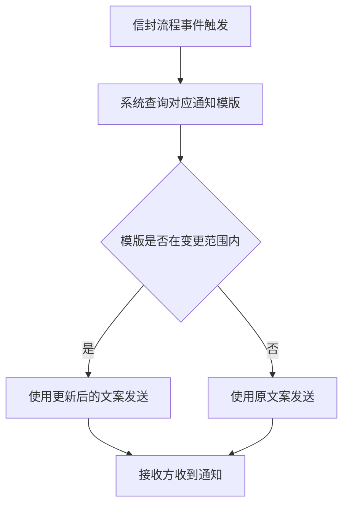

# 通知模版文案角色区分

## 1 文档元数据

| 字段 | 内容 |
| --- | --- |
| PRD-ID | F-001 |
| 产品线 | 消息通知 |
| 需求类型 | 现有功能优化 |
| 需求状态 | 草稿 |
| 当前版本 | V1.0 |
| 最后更新日期 | 2026-05-07 |
| 关键词（Tag） | 通知模版、文案、国际化、多语言 |
| 关联需求卡片 | drafts/F-001-通知模版文案角色区分/rdd.md |
| 关联变更清单 | prds/消息通知模板.xlsx（"本次调整标注" tab） |
| 关联页面规格卡 | 不涉及 |
| 关联原型文件 | 不涉及 |

## 2 文档修订记录

| 版本 | 日期 | 修订内容 | 修订人 |
| --- | --- | --- | --- |
| V1.0 | 2026-05-07 | 初稿，由 AI 基于 RDD 和《消息通知模板.xlsx》生成 | 煜翎 |

## 3 需求概要

### 3.1 问题与机会（概要）

签署人和审批人当前收到的通知内容相同，均使用"待签署"等特指签字操作的词语。当审批人（Approver）收到带有"待签署"字样的通知时，容易产生角色认知混乱——不清楚自己是需要签名还是审批，导致操作误解和客诉。

本需求通过统一将签名专属词替换为通用操作词（"待处理"/"操作完成"等各语言对应词），在不改变任何通知触发逻辑的前提下，消除文案歧义。

### 3.2 目标用户（概要）

- 核心用户：信封签署方（含审批人角色）
- 次级用户：信封发起方、信封抄送方（部分通知同时发送给这两类角色）

### 3.3 方案概述

以《消息通知模板.xlsx》"本次调整标注" tab 为唯一变更依据，对 5 个通知渠道（短信、邮件、Lark、WhatsApp、站内信）共 309 条、覆盖 17 种语言的通知模版，按"调整前→调整后"列逐条替换文案字段。不新增/删除任何模版，不改变通知触发逻辑、发送渠道和接收方配置。

### 3.4 成功指标（3-5 项）

| 指标 | 目标值 | 观测时间 | 数据来源 |
| --- | --- | --- | --- |
| 模版文案覆盖率 | 309 条全部替换，覆盖率 100% | 上线当日 QA 验收 | QA 对照 Excel 逐条核查 |
| 误改率 | 0 条（未标注模版不受影响） | 上线当日 QA 验收 | QA 抽查未标注条目 |
| 变量解析错误率 | 0 条（占位符完整保留） | 上线后 3 天内监控 | 通知发送日志 |

---

## 4 需求对象与概念模型

> 业务术语参考：context/business-glossary.md
> 以下列出本 PRD 涉及的核心角色术语（context/business-glossary.md 尚未初始化，先在此定义）。

| 名词 | 定义 | 约束/备注 |
| --- | --- | --- |
| 信封（Envelope） | 平台中的文件签署流程单元，包含文件、签署方配置和流程状态 | 本 PRD 中通知均以信封为维度触发 |
| 信封签署方 | 被指定参与文档签署或审批操作的人，包含签署人（Signer）和审批人（Approver） | 本次变更的核心受影响接收方 |
| 信封发起方 | 创建并发起签署流程的人 | 部分通知（如拒签、完成）同时发送给发起方 |
| 信封抄送方 | 收到流程通知但无需操作的人 | 部分完成/拒签通知会抄送 |
| 通知模版 | 系统在特定事件触发时向参与方发送的消息内容模板，含固定文案和动态变量占位符 | 本次只改文案字段，不改模版结构和触发逻辑 |
| 变量占位符 | 通知模版中的动态变量标记，如 `{deadline}`、`{envelopeSignUrl}`、`{senderName}` | 替换过程中必须保持原样，不得修改 |

---

## 5 功能结构

> 完整产品结构参考：context/product-feature-map.md
> 本需求无新增功能节点，变更范围仅为现有通知模版的文案内容字段。

### 5.1 本需求新增/调整的功能节点

本需求无新增功能节点，调整范围为：消息通知 → 通知模版内容字段（文案）。

### 5.2 本需求核心业务流程



### 5.3 核心业务规则

| 规则编号 | 规则描述 | 备注 |
| --- | --- | --- |
| BR-01 | 变量占位符（如 `{deadline}`、`{envelopeSignUrl}`、`{senderName}` 等）在文案替换过程中不得被修改、删除或改变大小写，否则通知内容将显示原始标记文本或链接失效 | 适用于全部 5 个渠道、17 种语言的所有条目 |
| BR-02 | 变更依据唯一来源为《消息通知模板.xlsx》"本次调整标注" tab 的"调整后"列；对于 Excel 中未标注的模版，文案保持原样，不得按经验自行判断修改 | 防止范围蔓延和误改 |

---

## 6 用户故事与用例

### 6.1 Epic

将消息通知系统中特指签字操作的文案统一替换为通用操作词，使审批人等非签名角色在收到通知时不产生角色认知混乱。

### 6.2 Must Have（MVP）

**故事 1：审批人收到通用文案通知**

```text
作为信封流程中的审批人，
我希望在收到系统通知时看到"待处理"等通用操作词而非"待签署"，
以便准确理解我需要执行的操作类型，避免因文案歧义产生误解。
```

验收标准（Gherkin）：

- Given 信封流程中触发任意通知事件（签署任务推送/过期提醒/催签/信封完成/信封取消/拒签）
- When 系统通过任一渠道（短信/邮件/Lark/WhatsApp/站内信）向信封参与方发送通知
- Then 通知文案与《消息通知模板.xlsx》"本次调整标注" tab 中对应条目的"调整后"列内容一致
- And 文案中的变量占位符（如 `{deadline}`、`{envelopeSignUrl}`）被正确解析为实际值，不显示原始标记

**故事 2：未标注模版不受影响**

```text
作为信封流程的参与方，
我希望未在本次调整范围内的通知模版文案保持不变，
以便不因本次变更引入意外的文案错误。
```

验收标准（Gherkin）：

- Given 通知模版未在《消息通知模板.xlsx》"本次调整标注" tab 中被标注
- When 系统触发并发送该通知
- Then 通知文案与本次变更前保持完全一致，无任何修改

---

## 7 功能清单（AI 实现主清单）

| 功能编号 | 功能名称（全限定） | 功能描述（Job Story） | 优先级 | 需求来源 |
| --- | --- | --- | --- | --- |
| NOTIF-TPL-001 | 通知模版-文案批量替换（5渠道 × 17语言） | 当信封流程触发通知时，我想要收到使用通用操作词的文案，这样我可以准确理解待办任务而不产生角色混淆 | P1 | 本版 |

---

## 8 功能需求说明书（逐功能展开）

### NOTIF-TPL-001 通知模版-文案批量替换 需求说明

#### 8.1 任务故事（Job Story）

当信封流程触发通知（推送/提醒/催签/完成/取消/拒签）时，我想要收到文案中不含签名专属词的通知，这样我可以准确理解自己的待办任务，不因"待签署"而误解操作类型。

#### 8.2 逻辑实现规范

##### Context（前置条件）

- 信封流程触发任意通知事件
- 该通知对应的模版条目在《消息通知模板.xlsx》"本次调整标注" tab 中有标注

##### Action（触发动作）

1. 研发按 Excel 行号定位对应通知模版的文案字段
2. 将"调整前"列文案替换为"调整后"列文案
3. 保持模版中所有变量占位符（`{deadline}`、`{envelopeSignUrl}` 等）原样不动
4. 覆盖范围：短信（72条）/ 邮件（83条）/ Lark（66条）/ WhatsApp（49条）/ 站内信（39条），共 309 条

##### Outcome（预期结果）

1. **文案变化**：接收方收到的通知文案与 Excel "调整后"列一致
2. **数据变化**：对应渠道的通知模版内容字段更新，其余字段（触发条件、接收方配置等）不变
3. **反馈提示**：不涉及前端界面变更

#### 8.3 异常处理要求

| 异常场景 | 触发条件 | 系统行为（预期结果） |
| --- | --- | --- |
| 变量占位符被误删或修改 | 替换过程中 `{deadline}` 等占位符被改动 | 通知内容显示原始标记文本或链接失效；QA 验收时须逐条确认占位符完整性 |
| WhatsApp 模版未通过平台审核 | WhatsApp 官方审核未通过 | 该渠道对应模版暂不上线，其他渠道不受影响；需提前确认审核时间窗口 |
| Excel 条目与实际模版行号不匹配 | 数据表结构与 Excel 行号对应关系存在偏差 | 开发须与 PM 核对，确认映射关系后再替换，不得盲目按行号操作 |

#### 8.4 业务流转图

不涉及（纯文案替换，无分支判断逻辑变更）。

#### 8.5 数据字典

不涉及（无新增数据字段，仅修改现有模版的文案内容字段值）。

#### 8.6 状态流转表

不涉及（通知模版无生命周期状态）。

#### 8.7 权限矩阵

不涉及（模版内容管理属后台操作，无前端多角色权限控制）。

#### 8.8 边界条件与并发规则

- **数值边界**：变更范围以 Excel "本次调整标注" tab 为准，共 309 条，不多不少
- **时序冲突**：替换操作为离线变更，无并发写入问题
- **数据依赖**：WhatsApp 渠道模版替换依赖平台审核通过，需提前确认审核周期

#### 8.9 PRD-页面规格卡映射

不涉及（本需求无前端页面变更）。

---

## 9 非功能性需求

### 9.1 性能要求

| 场景 | 要求 |
| --- | --- |
| 通知发送延迟 | 本次变更不影响通知发送链路和性能，与变更前保持一致 |

### 9.2 安全要求

无新增安全要求，通知内容不含敏感信息，与变更前一致。

### 9.3 可用性与可访问性

不涉及前端变更，无可用性要求变化。

### 9.4 兼容性要求

本功能涉及以下 5 个通知渠道，各渠道独立发送，互不影响：

| 渠道 | 变更条数 | 说明 |
| --- | --- | --- |
| 短信 | 72 条 | 覆盖 English + 简体/繁体中文 + 日/西/葡/泰/印尼/越/马/菲/德/法/俄/意/韩/阿语 |
| 邮件 | 83 条 | 同上 |
| Lark | 66 条 | 同上 |
| WhatsApp | 49 条 | 模版变更须通过 WhatsApp 官方重新审核，需确认审核周期 |
| 站内信 | 39 条 | 同上 |

---

## 10 验收检查清单

- [ ] **AC-1**：5个渠道全部 309 条模版文案按 Excel "调整后"列完成替换，无漏改
- [ ] **AC-2**：所有通知中的变量占位符（`{deadline}`、`{envelopeSignUrl}` 等）被正确解析为实际值，不显示原始标记
- [ ] **AC-3**：Excel 中未标注的通知模版文案与调整前保持一致，无意外修改

---

## 11 范围外（Out of Scope）

- 不区分签署人与审批人各自收到不同文案（后续规划：根据角色动态下发"待审批"/"待签署"）
- 不变更任何通知触发逻辑、发送时机、渠道配置
- 不新增或删除任何通知模版
- 不对未在 Excel "本次调整标注" tab 中标注的条目做任何修改

---

## 12 开放问题

| # | 问题 | 提出方 | 状态 |
| --- | --- | --- | --- |
| 1 | WhatsApp 模版变更是否需要平台重新提审？预计审核周期多长？是否影响上线排期？ | 煜翎 | 待确认 |
| 2 | Excel 行号与系统数据表行号的映射关系是否 1:1 对应？开发需在实施前与 PM 核对 | 煜翎 | 待确认 |

---

## 变更记录

> 详细变更历史见同目录 `CHANGELOG.md`。

| 版本 | 日期 | 变更摘要 |
| --- | --- | --- |
| 1.0 | 2026-05-07 | 初始版本 |
