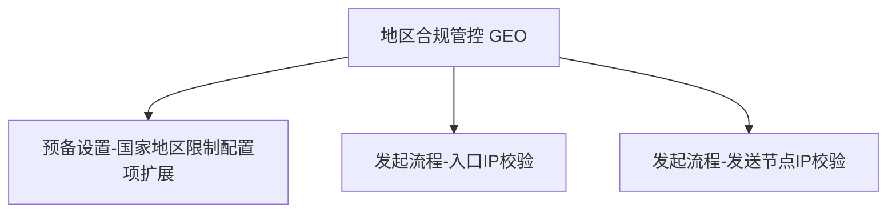
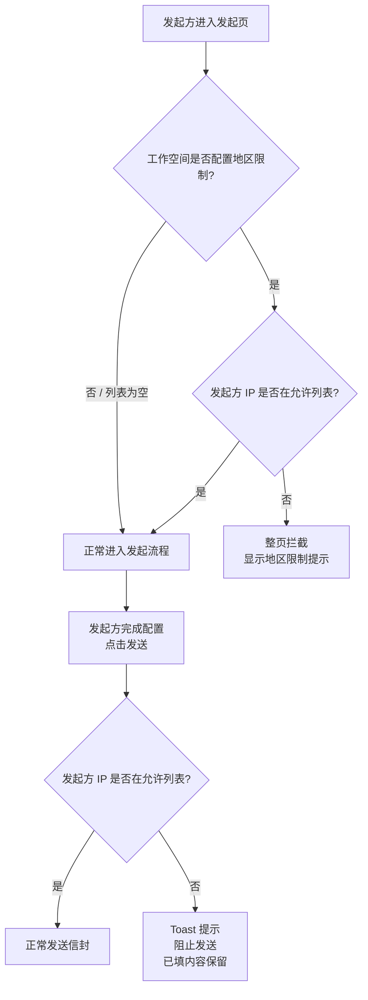

# 发起方地区限制

## 1 文档元数据

| 字段 | 内容 |
| --- | --- |
| PRD-ID | F-004 |
| 产品线 | eSignGlobal |
| 需求类型 | 新功能 |
| 需求状态 | 草稿 |
| 当前版本 | V1.0 |
| 最后更新日期 | 2026-05-26 |
| 关键词（Tag） | IP 限制、地区合规、数据跨境、发起方 |
| 关联需求卡片 | drafts/F-004-发起方地区限制/rdd.md |
| 关联页面规格卡 | 待产出 |
| 关联原型文件 | 待产出 |

## 2 文档修订记录

| 版本 | 日期 | 修订内容 | 修订人 |
| --- | --- | --- | --- |
| V1.0 | 2026-05-26 | 初稿，由 AI 基于 RDD 生成 | 煜翎 |

## 3 需求概要

### 3.1 问题与机会（概要）

俄罗斯等国家对数据出入境有严格限制，若发起方从这些国家创建并发送信封，合同数据可能触犯当地数据本地化法规。现有「签署人国家/地区限制」功能已能控制签署侧的地区合规，但尚未覆盖发起侧。本需求将该配置的控制范围扩展至发起方：同一套国家/地区列表，既约束签署人，也约束发起人。

### 3.2 目标用户（概要）

- 核心用户：工作空间超级管理员（配置者）
- 受影响用户：发起方 Sender（在发起流程中受 IP 校验约束）

### 3.3 方案概述

在「设置 > 偏好设置 > 签署 Tab」中，对现有「签署人国家/地区限制」配置项进行扩展：更新名称与描述文案，使其明确覆盖发起侧；配置生效后，系统在发起方进入各发起入口时和点击发送时各执行一次 IP 地区校验，命中限制则分别以整页拦截和 Toast 形式阻止操作。覆盖的发起入口包括：单方签、单个发起、批量发起、草稿发起、信封编辑、信封模版发起，以及 Lark 多维表发起（P2）。

### 3.4 成功指标（3-5 项）

| 指标 | 目标值 | 观测时间 | 数据来源 |
| --- | --- | --- | --- |
| 受限地区发起方被拦截率 | 100%（进入节点 + 发送节点均拦截） | 上线后首个完整周 | 服务端 IP 校验日志 |
| 管理员无需工单完成配置 | 新配置项描述清晰，0 工单咨询 | 上线后首月 | 客服工单系统 |
| 现有签署侧拦截行为无回归 | 签署侧拦截通过率 = 上线前基线 | 上线后首周 | 签署端 IP 校验日志 |

---

## 4 需求对象与概念模型

本需求无新增术语，已有术语参见 `context/business-glossary.md`。

> 参考术语：发起方地区限制（见 business-glossary.md §合规管控）

---

## 5 功能结构

> 完整产品结构参考：`context/product-feature-map.md`
> 以下仅列出本需求新增/调整的节点。

### 5.1 本需求新增/调整的功能节点



### 5.2 本需求核心业务流程



### 5.3 核心业务规则

| 规则编号 | 规则描述 | 备注 |
| --- | --- | --- |
| BR-01 | 「偏好设置 > 签署 Tab」中「国家/地区限制」配置的国家/地区列表，同时控制签署侧（签署人访问 & 提交）和发起侧（发起方进入各发起入口 & 发送），两侧共用同一份配置 | 配置项更名并扩展，非新建 |
| BR-02 | 配置列表为空时，限制不生效，所有地区的发起方和签署人均可正常操作 | 空列表 = 全域开放 |
| BR-03 | IP 地理位置定位可能受 VPN 或数据漫游影响，存在误判风险；此局限性须在配置项描述文案中注明，由管理员知情承担 | 同签署侧现有局限 |

---

## 6 用户故事与用例

### 6.1 Epic

为工作空间提供统一的地区合规管控能力，通过同一套国家/地区配置，同时约束信封的发起行为和签署行为，满足数据跨境合规要求。

### 6.2 Must Have（MVP）

**故事 1：管理员扩展地区限制至发起侧**

```text
作为工作空间超级管理员，
我希望在预备设置的国家/地区限制配置中看到清晰的说明——该配置同时控制发起方的地区合规，
以便我知道配置一次就能覆盖签署和发起两个场景，无需单独维护两份配置。
```

验收标准：
- Given 管理员进入预备设置页面
- When 查看国家/地区限制配置项
- Then 配置项名称或描述中包含关于「同时限制发起方」的说明

**故事 2：发起方在入口被地区拦截**

```text
作为从受限地区尝试发起信封的发起方，
我希望在进入发起流程时立即收到明确的地区限制提示，
以便我知道当前操作不被允许，以及应如何处理（检查网络 / 联系管理员）。
```

验收标准：
- Given 工作空间已配置国家/地区限制列表（非空），且发起方当前 IP 不在允许列表中
- When 发起方进入信封发起页
- Then 页面展示整页拦截提示（文案风格参考签署侧，含建议处理方式）
- And 发起方无法进入后续发起配置步骤

- Given 工作空间国家/地区限制列表为空
- When 发起方进入信封发起页
- Then 正常进入发起流程，无拦截

**故事 3：发起方在发送节点被地区拦截**

```text
作为已进入发起流程但在点击发送前切换至受限网络的发起方，
我希望在点击发送时收到 Toast 提示并保留已填写内容，
以便我了解发送失败原因，并在切换网络后重试，不丢失填写进度。
```

验收标准：
- Given 发起方已进入发起流程完成配置，但当前 IP 不在工作空间允许列表中
- When 发起方点击发送按钮
- Then 显示 Toast 错误提示，发送操作被阻止
- And 已填写的信封配置内容完整保留，不丢失

- Given 发起方 IP 在允许列表中
- When 发起方点击发送按钮
- Then 正常发送信封

---

## 7 功能清单（AI 实现主清单）

> 新模块前缀：GEO（Geographic Restriction / 地区合规管控），首次引入于 F-004。

| 功能编号 | 功能名称（全限定） | 功能描述（Job Story） | 优先级 | 需求来源 |
| --- | --- | --- | --- | --- |
| GEO-CFG-001 | 偏好设置-签署Tab-国家地区限制配置项-文案扩展与交互增强 | 当管理员查看偏好设置时，我想要配置项说明能清晰体现其同时控制发起侧，且国家/地区多选支持一键全选和一键取消全选，这样我可以高效完成配置 | P1 | 本版 |
| GEO-INIT-001 | 发起流程-单个发起入口-发起方IP地区校验拦截 | 当发起方进入单个信封发起页时，我想要系统自动校验其 IP 地区，这样我可以确保受限地区的发起方无法启动发起流程 | P1 | 本版 |
| GEO-INIT-002 | 发起流程-批量发起入口-发起方IP地区校验拦截 | 当发起方进入批量发起流程时，我想要系统自动校验其 IP 地区，这样我可以确保受限地区的发起方无法启动批量发起 | P1 | 本版 |
| GEO-INIT-003 | 发起流程-单方签入口-发起方IP地区校验拦截 | 当发起方进入单方签流程时，我想要系统自动校验其 IP 地区，这样我可以确保受限地区的发起方无法启动单方签 | P1 | 本版 |
| GEO-INIT-004 | 发起流程-草稿发起入口-发起方IP地区校验拦截 | 当发起方从草稿列表发起信封时，我想要系统自动校验其 IP 地区，这样我可以确保受限地区的发起方无法将草稿提交发出 | P1 | 本版 |
| GEO-INIT-005 | 发起流程-信封编辑入口-发起方IP地区校验拦截 | 当发起方进入信封编辑页时，我想要系统自动校验其 IP 地区，这样我可以确保受限地区的发起方无法编辑并重新发送信封 | P1 | 本版 |
| GEO-INIT-006 | 发起流程-信封模版发起入口-发起方IP地区校验拦截 | 当发起方通过信封模版发起信封时，我想要系统自动校验其 IP 地区，这样我可以确保受限地区的发起方无法从模版创建信封 | P1 | 本版 |
| GEO-INIT-007 | 发起流程-Lark多维表发起入口-发起方IP地区校验拦截 | 当发起方通过 Lark 多维表插件发起信封时，我想要系统自动校验其 IP 地区，这样我可以确保受限地区的发起方无法通过该入口发起 | P2 | 本版 |
| GEO-SEND-001 | 发起流程-发送节点-发起方IP地区校验拦截 | 当发起方在任意发起流程中点击发送时，我想要系统再次校验其 IP 地区，这样我可以防止进入流程后切换网络绕过入口校验 | P1 | 本版 |

---

## 8 功能需求说明书（逐功能展开）

---

### GEO-CFG-001 偏好设置-签署Tab-国家地区限制配置项-文案扩展 需求说明

#### 8.1 任务故事（Job Story）

当管理员在「设置 > 偏好设置 > 签署 Tab」中查看「签署人国家/地区限制」配置项时，我想要配置项更名为「国家/地区限制」并更新描述以体现同时控制发起方，且国家/地区多选支持一键全选与一键取消全选，这样我可以理解配置的完整影响范围，并在需要时高效批量操作。

#### 8.2 逻辑实现规范

##### Context（前置条件）

- 管理员已进入「设置 > 偏好设置 > 签署 Tab」
- 「签署人国家/地区限制」配置项已存在

##### Action（触发动作）

1. 管理员查看配置项名称与描述
2. （可选）管理员展开国家/地区多选下拉
3. （可选）管理员点击「全选」——选中所有国家/地区
4. （可选）管理员点击「取消全选」——清空所有已选国家/地区
5. （可选）管理员搜索特定国家/地区后进行单选
6. 管理员保存配置

##### Outcome（预期结果）

1. **界面变化**：配置项名称从「签署人国家/地区限制」更名为「国家/地区限制」；描述文案更新，明确说明该配置同时限制签署人和发起方的地区合规；多选下拉列表顶部展示「全选」与「取消全选」操作项
2. **全选行为**：点击「全选」后，下拉列表中所有国家/地区均被勾选；若已有部分选中，点击全选补全剩余项
3. **取消全选行为**：点击「取消全选」后，所有已选项清空，配置项回到空值状态（等同于限制未启用）
4. **数据变化**：配置数据结构不变，已有配置值保持不变
5. **反馈提示**：保存成功后展示现有 Toast 反馈

#### 8.3 异常处理要求

| 异常场景 | 触发条件 | 系统行为（预期结果） |
| --- | --- | --- |
| 存量已配置客户 | 上线前已配置地区限制的工作空间 | 配置值不变，仅文案更新；上线后发起侧校验是否自动生效待 OQ-5 决策 |
| 全选后保存 | 管理员点击全选并保存 | 所有国家/地区均生效为限制范围，任何地区均无法发起或签署 |
| 取消全选后保存 | 管理员点击取消全选并保存 | 配置为空，限制不生效，所有地区均可正常发起和签署 |

#### 8.4 业务流转图

不涉及

#### 8.5 数据字典

不涉及（配置数据结构复用现有，无新增字段）

#### 8.6 状态流转表

不涉及

#### 8.7 权限矩阵

| 角色 | 可见范围 | 可执行动作 | 数据范围约束 | 失败提示 |
| --- | --- | --- | --- | --- |
| 超级管理员 | 配置项可见 | 查看、修改国家/地区列表 | 本工作空间 | — |
| 普通成员 / 发起方 | 配置项不可见 | 不可操作 | — | — |

#### 8.8 边界条件与并发规则

不涉及

#### 8.9 PRD-页面规格卡映射

| 功能编号 | PRD 章节位置 | 页面规格卡区段 | 页面规格卡状态 | 一致性说明 |
| --- | --- | --- | --- | --- |
| GEO-CFG-001 | §8.1 | 预备设置 — 国家地区限制配置项 | 待产出 | 待确认 |

---

### GEO-INIT-001 ～ GEO-INIT-007 发起流程-各入口-发起方IP地区校验拦截 需求说明

> GEO-INIT-001～007 逻辑完全一致，仅触发入口不同，统一描述如下。

#### 覆盖入口一览

| 功能编号 | 入口名称 | 入口描述 | 优先级 |
| --- | --- | --- | --- |
| GEO-INIT-001 | 单个发起 | 新建单个信封，进入发起配置页 | P1 |
| GEO-INIT-002 | 批量发起 | 进入批量发起流程入口页 | P1 |
| GEO-INIT-003 | 单方签 | 进入单方签（自签）流程入口页 | P1 |
| GEO-INIT-004 | 草稿发起 | 从草稿列表点击「继续发起」进入草稿编辑页 | P1 |
| GEO-INIT-005 | 信封编辑 | 进入已发出信封的编辑页；确认/保存时再次校验（双节点） | P1 |
| GEO-INIT-006 | 信封模版发起 | 从信封模版点击「使用模版发起」进入配置页 | P1 |
| GEO-INIT-007 | Lark 多维表发起 | 从 Lark 多维表插件触发信封发起 | P2 |

#### 8.1 任务故事（Job Story）

当发起方通过以上任意入口进入信封发起流程时，我想要系统立即校验其 IP 地区，若不在允许列表则展示整页拦截，这样我可以在发起方填写任何内容之前阻止受限操作，避免用户填完表单才被告知无法提交。

#### 8.2 逻辑实现规范

##### Context（前置条件）

- 工作空间已在「设置 > 偏好设置 > 签署 Tab」中配置国家/地区限制列表（非空）
- 发起方点击上表中任意一个入口

##### Action（触发动作）

1. 发起方点击入口，系统在页面渲染前获取发起方当前 IP
2. 系统将 IP 映射到地理位置
3. 系统比对该地理位置与工作空间配置的允许列表

##### Outcome（预期结果）

1. **IP 在允许列表**：正常展示对应发起页，无额外提示
2. **IP 不在允许列表**：展示整页拦截视图，阻止进入后续流程；文案参考签署侧访问拦截风格，其中"联系发起方"替换为"联系工作空间管理员"
3. **列表为空**：等同于限制未启用，正常展示对应发起页

#### 8.3 异常处理要求

| 异常场景 | 触发条件 | 系统行为（预期结果） |
| --- | --- | --- |
| IP 地理位置服务不可用 | IP 映射服务超时或报错 | 降级拦截：IP 无法识别时按受限处理，展示整页拦截提示（安全优先） |
| 配置列表为空 | 管理员未配置任何国家/地区 | 视为限制未启用，正常放行 |
| IP 受 VPN 影响 | 发起方通过 VPN 访问，实际 IP 与物理地区不符 | 以系统检测到的 IP 为准，不做额外处理；配置项文案已注明此局限性 |

#### 8.4 业务流转图

见 §5.2

#### 8.5 数据字典

不涉及（IP 校验为实时计算，不持久化）

#### 8.6 状态流转表

不涉及

#### 8.7 权限矩阵

不涉及（IP 校验对所有尝试发起的用户均生效，不区分角色）

#### 8.8 边界条件与并发规则

- **配置列表上限**：复用签署侧现有条目数上限
- **缓存策略**：每次进入入口重新校验 IP，不缓存上次校验结果
- **Lark 入口（GEO-INIT-007）**：从 Lark 插件跳转至 eSignGlobal 发起页的时机执行校验，Lark 侧不感知校验结果

#### 8.9 PRD-页面规格卡映射

| 功能编号 | PRD 章节位置 | 页面规格卡区段 | 页面规格卡状态 | 一致性说明 |
| --- | --- | --- | --- | --- |
| GEO-INIT-001～006 | §8.2 | 各发起入口页 — 整页拦截视图 | 待产出 | 拦截视图复用同一组件，各入口无差异 |
| GEO-INIT-007 | §8.2 | Lark 发起入口 — 整页拦截视图 | 待产出 | P2，视图复用 |

---

### GEO-SEND-001 发起流程-发送节点-发起方IP地区校验拦截 需求说明

#### 8.1 任务故事（Job Story）

当发起方完成信封配置并点击发送时，我想要系统再次校验其 IP 地区，这样我可以防止发起方进入流程后切换至受限网络再完成发送。

#### 8.2 逻辑实现规范

##### Context（前置条件）

- 发起方已通过入口 IP 校验，正常进入发起流程并完成配置
- 发起方点击发送按钮

##### Action（触发动作）

1. 发起方点击发送，系统重新获取当前 IP
2. 系统重新执行地区校验（同 GEO-INIT-001 逻辑）
3. 返回校验结果

##### Outcome（预期结果）

1. **IP 在允许列表**：正常发送信封
2. **IP 不在允许列表**：展示 Toast 错误提示，阻止发送；已填写的信封配置内容完整保留，不清空

#### 8.3 异常处理要求

| 异常场景 | 触发条件 | 系统行为（预期结果） |
| --- | --- | --- |
| IP 地理位置服务不可用 | 发送时 IP 映射服务超时/报错 | 降级拦截：IP 无法识别时按受限处理，Toast 提示阻止发送（与入口校验策略保持一致） |
| 列表为空 | 管理员未配置任何国家/地区 | 视为限制未启用，正常发送 |

#### 8.4 业务流转图

见 §5.2

#### 8.5 数据字典

不涉及

#### 8.6 状态流转表

不涉及

#### 8.7 权限矩阵

不涉及

#### 8.8 边界条件与并发规则

- **内容保留**：Toast 触发时，发起表单所有已填字段（文件、签署方、控件配置等）不得清空，用户调整网络后可直接重新点击发送

#### 8.9 PRD-页面规格卡映射

| 功能编号 | PRD 章节位置 | 页面规格卡区段 | 页面规格卡状态 | 一致性说明 |
| --- | --- | --- | --- | --- |
| GEO-SEND-001 | §8.3 | 发起页 — 发送节点拦截 Toast | 待产出 | 待确认 |

---

## 9 非功能性需求

### 9.1 性能要求

| 场景 | 要求 |
| --- | --- |
| IP 地区校验响应时间 | 不增加发起页加载时间超过 200ms（P95） |
| 发送节点校验响应时间 | Toast 提示在点击发送后 1s 内展示 |

### 9.2 安全要求

- IP 校验在服务端执行，不依赖客户端上报
- 不在前端日志或 URL 中暴露允许地区列表

### 9.3 可用性与可访问性

- 拦截提示文案须包含处理建议（检查网络 / 联系管理员），不得仅展示"无权操作"
- Toast 提示需满足 WCAG 对比度要求

### 9.4 兼容性要求

本功能 IP 校验在服务端执行，客户端无差异，全端行为一致。

### 9.5 数据统计需求

| 事件对象 | 触发动作 | 事件名 | 属性 | 属性值说明 |
| --- | --- | --- | --- | --- |
| 发起页 | IP 校验失败，整页拦截展示 | geo_block_init_view | workspace_id, detected_region | 用于统计拦截频次 |
| 发起页 | 发送节点 IP 校验失败，Toast 展示 | geo_block_send_toast | workspace_id, detected_region | 用于统计发送节点拦截频次 |

---

## 10 验收检查清单

- [ ] **AC-1**：管理员在「设置 > 偏好设置 > 签署 Tab」查看配置项，名称已更新为「国家/地区限制」，描述包含「同时限制发起方地区」的说明
- [ ] **AC-1a**：国家/地区多选下拉展开后，顶部展示「全选」与「取消全选」操作项
- [ ] **AC-1b**：点击「全选」后所有国家/地区被勾选；点击「取消全选」后所有勾选项清空
- [ ] **AC-2**：工作空间已配置非空地区列表，发起方从未列出地区进入**单个发起**入口，展示整页拦截提示，无法进入配置步骤
- [ ] **AC-3**：工作空间已配置非空地区列表，发起方从未列出地区分别进入**批量发起、单方签、草稿发起、信封编辑、信封模版发起**入口，均展示整页拦截提示
- [ ] **AC-4**：工作空间地区列表为空，发起方从任意地区进入任意发起入口，正常进入，无拦截
- [ ] **AC-5**：发起方已进入发起流程完成配置，点击发送时 IP 不在允许列表，显示 Toast 提示，发送被阻止，已填内容不丢失
- [ ] **AC-6**：发起方 IP 在允许列表中，点击发送正常发送信封
- [ ] **AC-7**：签署侧现有拦截行为无回归——签署人从受限地区访问签署链接时，仍被正常拦截

---

## 11 范围外（Out of Scope）

- API 发起不受地区限制约束（本期不做）
- VPN 精确识别 / 代理穿透检测
- 发起侧 per-envelope 地区限制开关（发起侧限制为工作空间全局生效，无信封维度控制）
- 拦截事件审计日志
- 独立的「发起方地区限制」配置项（复用现有签署侧配置，不新建）

---

## 12 开放问题

| # | 问题 | 提出方 | 状态 |
| --- | --- | --- | --- |
| 1 | 配置项名称如何更新？建议从「签署人国家/地区限制」改为「国家/地区限制」或「签署人 & 发起人国家/地区限制」，待 PM/Design 确认 | AI | ✅ 已确认：更名为「国家/地区限制」 |
| 2 | IP 地区服务不可用时的降级策略：放行 vs 拦截？建议放行（可用性优先），但需产品决策 | AI | ✅ 已确认：降级时拦截（安全优先） |
| 3 | 发起方拦截文案（英文）建议在签署侧基础上微调：将 "reach out to the sender" 替换为 "reach out to your workspace administrator"，其余沿用。待 PM/Design 最终确认 | AI | ✅ 已确认：沿用签署侧文案风格，调整联系对象为 workspace administrator |
| 4 | 信封编辑（GEO-INIT-005）的触发时机：是「进入编辑页」即拦截，还是「点击重新发送/保存」时拦截？ | AI | ✅ 已确认：进入编辑页时拦截 + 确认/保存时再次拦截（双节点，与其他入口保持一致） |
| 5 | **向后兼容问题**：已有客户的「签署人国家/地区限制」配置上线后将自动对发起侧生效，可能导致这些客户的发起方被意外拦截（例如客户仅配置了"香港"用于签署合规，但其发起方不在香港）。如何处理？方案待定，候选：(A) 静默生效（风险：客户发起被意外阻断）；(B) 上线前通知受影响客户；(C) 在配置项中增加「是否同时限制发起方」独立开关，存量客户默认 OFF | AI | 待确认 |

---

## 变更记录

> 详细变更历史见同目录 `CHANGELOG.md`。

| 版本 | 日期 | 变更摘要 |
| --- | --- | --- |
| 1.0 | 2026-05-26 | 初始版本 |
