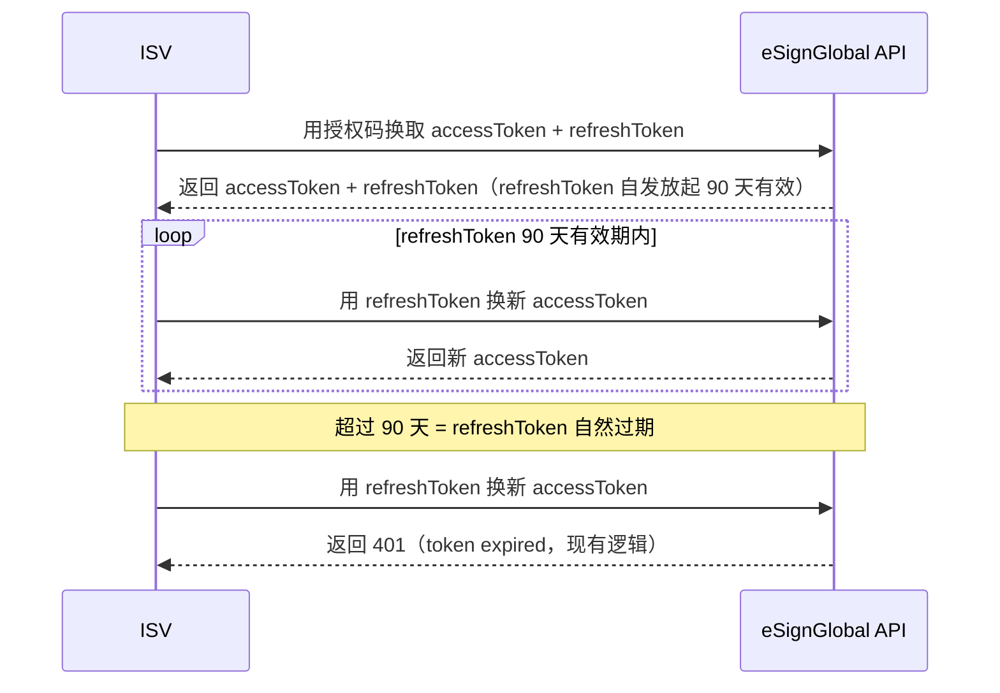

# ISV 授权关系优化

## 1 文档元数据

| 字段 | 内容 |
| --- | --- |
| PRD-ID | F-005 |
| 产品线 | eSignGlobal 主产品 |
| 需求类型 | 现有功能优化 |
| 需求状态 | 草稿 |
| 当前版本 | V1.2 |
| 最后更新日期 | 2026-06-21 |
| 关键词（Tag） | ISV、OAuth、授权关系、token |
| 关联需求卡片 | drafts/ISV授权关系优化/rdd.md |
| 关联页面规格卡 | 不涉及（纯后端改动，无页面变更） |
| 关联原型文件 | 不涉及 |

## 2 文档修订记录

| 版本 | 日期 | 修订内容 | 修订人 |
| --- | --- | --- | --- |
| V1.2 | 2026-06-21 | 产品化表述授权关系与 refreshToken 有效期规则，移除数据字典和实现字段描述 | 煜翎 |
| V1.1 | 2026-06-21 | 明确 refreshToken 有效期为 90 天 | 煜翎 |
| V1.0 | 2026-06-10 | 初稿 | 煜翎 |

## 3 需求概要

### 3.1 问题与机会

ISV 通过 OAuth 2.0 授权流程将 eSignGlobal 签署能力集成进自有系统后，当前授权关系设有 365 天到期限制。到期后 refreshToken 随之失效，ISV 系统若未做主动续期处理，集成服务将被迫中断，需人工介入重新完成授权。这一机制对于企业级长期集成场景不友好，也是 ISV 客户产生集成中断投诉的主要原因。

### 3.2 目标用户

- 核心用户：ISV 开发者（将 eSignGlobal 签署能力集成进自有系统的技术负责人）

### 3.3 方案概述

两个并行改动，均为后端规则调整，无页面改动：

1. **去除授权关系 365 天固定时效**：新建立的 ISV 授权关系不再因为达到 365 天而自动失效，除非后续被主动撤销或触发其他既有失效规则。
2. **refreshToken 有效期固定为 90 天**：每次发放 refreshToken 后，该 refreshToken 自发放起 90 天内可用于刷新 accessToken；超过 90 天后自然过期，行为与现有 token 过期逻辑完全一致。

### 3.4 成功指标

| 指标 | 目标值 | 观测时间 | 数据来源 |
| --- | --- | --- | --- |
| ISV 因授权到期导致的集成中断工单数 | 归零（对比上线前同期） | 上线后 90 天 | 客服工单系统 |

---

## 4 需求对象与概念模型

| 名词 | 定义 | 约束/备注 |
| --- | --- | --- |
| ISV 授权关系 | ISV 应用通过 OAuth 2.0 授权流程获得的、代表某 eSignGlobal 用户授权该 ISV 访问其账号资源的关系 | 本需求去除其 365 天固定到期限制 |
| refreshToken 有效期 | refreshToken 可用于换取新 accessToken 的有效窗口 | 本需求明确 refreshToken 自发放起固定有效 90 天 |

其余已有术语（OAuth Token、accessToken、refreshToken、ISV）参见 `context/business-glossary.md`。

---

## 5 功能结构

### 5.1 本需求新增/调整的功能节点

本需求仅调整 ISV 授权关系与 refreshToken 的有效期规则，不新增功能节点。完整产品结构参见 `context/product-feature-map.md`。

### 5.2 本需求核心业务流程



### 5.3 核心业务规则

| 规则编号 | 规则描述 | 备注 |
| --- | --- | --- |
| BR-01 | refreshToken 自发放起固定有效 90 天；后续刷新沿用现有 token 过期处理逻辑 | 固定 90 天有效期 |

---

## 6 用户故事与用例

### 6.1 Epic

去除 ISV OAuth 授权关系的 365 天硬性到期限制，同时明确 refreshToken 固定 90 天有效期，使企业级集成不再因授权关系到期被强制中断，并保留 token 自身有效期边界。

### 6.2 Must Have（MVP）

**故事 1：授权关系不因 365 天到期而失效，refreshToken 固定 90 天有效**

```text
作为 ISV 开发者，
我希望建立的授权关系不因固定时效到期而失效，refreshToken 在 90 天有效期内可持续用于刷新 accessToken，
以便集成系统在 token 有效期内稳定运行，不再因平台授权关系到期被强制中断。
```

验收标准（Gherkin）：

- Given 一条已存在的 ISV 授权关系，其创建时间超过 365 天，且 refreshToken 仍在 90 天有效期内
- When ISV 使用该授权关系下的 refreshToken 请求刷新 accessToken
- Then 系统返回新的 accessToken，不返回 token 过期错误

- Given 一条 ISV 授权关系，其 refreshToken 已超过 90 天有效期
- When ISV 使用该 refreshToken 请求刷新 accessToken
- Then 系统返回 401 token expired（与现有 token 过期行为一致）

---

## 7 功能清单

| 功能编号 | 功能名称（全限定） | 功能描述（Job Story） | 优先级 | 需求来源 |
| --- | --- | --- | --- | --- |
| ISV-AUTH-001 | ISV授权关系-去除365天到期时效 | 当 ISV 授权关系建立后，系统不再因固定 365 天时效使授权关系自动失效，ISV 集成无需因授权关系到期重新授权 | P1 | 本版 |
| ISV-AUTH-002 | refreshToken-固定90天有效期 | 当系统发放 refreshToken 时，该 token 自发放起 90 天内有效，使 ISV 明确 token 可用窗口 | P1 | 本版 |

---

## 8 功能需求说明书

---

### ISV-AUTH-001 ISV授权关系-去除365天到期时效

#### 8.1 任务故事（Job Story）

当 ISV 授权关系创建时，系统不再设置固定 365 天到期限制，使该授权关系在未被主动撤销或触发其他既有失效规则前保持有效，ISV 的 refreshToken 刷新流程不会因授权关系到期而失败。

#### 8.2 逻辑规则

##### Context（前置条件）

- ISV 应用已完成 OAuth 2.0 授权流程
- 当前授权关系存在 365 天固定到期限制

##### Action（触发动作）

1. **新建授权关系时**：系统不再为授权关系设置 365 天固定到期限制
2. **refreshToken 刷新时**：系统不再因授权关系达到 365 天而拒绝刷新；授权关系是否有效仍按既有有效 / 已撤销等状态判断
3. **存量授权关系**：已失效的历史授权关系不做批量恢复；仍有效的存量授权关系上线后不再因 365 天固定时效自动失效

##### Outcome（预期结果）

1. **行为变化**：ISV 调用 refreshToken 接口不再收到因授权关系 365 天到期导致的 401 错误
2. **反馈提示**：无面向用户的提示变化，ISV 侧透明

#### 8.3 异常处理要求

| 异常场景 | 触发条件 | 系统行为（预期结果） |
| --- | --- | --- |
| 使用已撤销授权关系下的 token | ISV 用 refreshToken 刷新，但对应授权关系已被撤销 | 返回 401，错误码与现有「token 无效」一致，不引入新错误码（撤销能力后续版本才做，此场景暂不新增） |
| refreshToken 本身过期 | refreshToken 超过 90 天有效期 | 返回现有 401 token expired，行为不变 |

#### 8.4 业务流转图

不涉及（无分支判断变化，流程同现有 OAuth 刷新流程）。

#### 8.5 数据字典

不涉及。

#### 8.6 状态流转表

不涉及（授权关系状态枚举和流转规则本次不调整）。

#### 8.7 权限矩阵

不涉及（后端内部逻辑，无角色权限变化）。

#### 8.8 边界条件与并发规则

- **存量授权关系**：上线前已失效的授权关系不自动恢复；上线时仍有效的授权关系，不再因 365 天固定时效自动失效

#### 8.9 PRD-页面规格卡映射

不涉及（本需求无页面变更）。

---

### ISV-AUTH-002 refreshToken-固定90天有效期

#### 8.1 任务故事（Job Story）

当系统发放 refreshToken 时，该 token 自发放起固定 90 天内有效，使 token 具备明确有效窗口。

#### 8.2 逻辑规则

##### Context（前置条件）

- ISV 完成 OAuth 授权流程，系统准备发放 accessToken + refreshToken

##### Action（触发动作）

1. **发放 refreshToken 时**：该 refreshToken 自发放起 90 天内有效
2. **刷新 accessToken 时**：沿用现有 token 是否过期的校验逻辑，无需变动；token 未过期则正常发放新 accessToken，已过期（即超过 90 天有效期）则按现有 401 流程处理

##### Outcome（预期结果）

1. **行为变化**：ISV 刷新行为在 90 天有效期内与现有完全一致；超过 90 天后刷新返回现有 401 token expired
2. **ISV 侧透明**：无新增错误码，ISV 侧对 token 过期的处理逻辑无需变更

#### 8.3 异常处理要求

| 异常场景 | 触发条件 | 系统行为（预期结果） |
| --- | --- | --- |
| 超过 90 天后 ISV 刷新 | refreshToken 已超过 90 天有效期 | 返回现有 401 token expired，行为不变 |

#### 8.4 业务流转图

不涉及（无新增业务分支，流程同现有 OAuth 刷新流程）。

#### 8.5 数据字典

不涉及。

#### 8.6 状态流转表

不涉及。

#### 8.7 权限矩阵

不涉及。

#### 8.8 边界条件与并发规则

- **时间计算口径**：90 天有效期以 refreshToken 发放时刻为起点，按自然日连续计算

#### 8.9 PRD-页面规格卡映射

不涉及（本需求无页面变更）。

---

## 9 非功能性需求

### 9.1 性能要求

| 场景 | 要求 |
| --- | --- |
| refreshToken 刷新接口 | 刷新路径无新增运行时调用，响应时间与现有基线持平 |
| OAuth 发放 refreshToken | 仅新增 90 天有效期规则，不引入外部服务查询，响应时间与现有基线持平 |

### 9.2 安全要求

- 授权关系长期有效后，token 泄露影响窗口由 refreshToken 90 天有效期限制，超过 90 天后 token 自然失效。
- 当前阶段无主动撤销手段，需在 ISV 开发者文档中明确：如需紧急解除授权，须联系平台客服处理。
- 撤销能力（后续版本）上线前，客服侧需具备后台强制失效授权关系的操作能力（运营保障，需提前确认）。

### 9.3 可用性与可访问性

不涉及（无页面变更）。

### 9.4 兼容性要求

本功能为纯后端变更，对 ISV 侧 API 调用行为完全向前兼容，无端差异。

### 9.5 数据统计需求

不涉及。

---

## 10 验收检查清单

- [ ] **AC-1**：创建时间超过 365 天的授权关系，refreshToken 仍在 90 天有效期内，刷新返回新 accessToken，不返回 token 过期错误
- [ ] **AC-2**：发放 refreshToken 时，该 token 自发放起 90 天内有效
- [ ] **AC-3**：refreshToken 超过 90 天有效期后，刷新返回现有 401 token expired

---

## 11 范围外（Out of Scope）

- 用户侧"已授权应用"管理页面（查看 ISV 授权列表）
- 用户主动撤销 ISV 授权功能
- Webhook 推送 `authorization.revoked` 事件
- ISV 侧主动撤销接口
- 平台管理员后台强制撤销

---

## 12 开放问题

| # | 问题 | 提出方 | 状态 |
| --- | --- | --- | --- |
| Q1 | 存量授权关系迁移策略：上线前已失效的授权关系是否保持失效？上线时仍有效的授权关系是否统一适用新规则？建议按本 PRD 当前规则执行，需研发确认影响范围 | 产品 | 待研发确认 |
| Q2 | 客服侧后台强制失效授权关系的操作能力是否已有？如无，需提前排期（安全兜底，先于本版上线） | 产品 | 待运营/客服确认 |

---

## 变更记录

| 版本 | 日期 | 变更摘要 |
| --- | --- | --- |
| 1.2 | 2026-06-21 | 移除数据字典和具体字段/表结构表述，改为产品规则口径 |
| 1.1 | 2026-06-21 | 明确 refreshToken 有效期固定为 90 天，并同步更新流程、规则、验收与非功能要求 |
| 1.0 | 2026-06-10 | 初始版本 |
